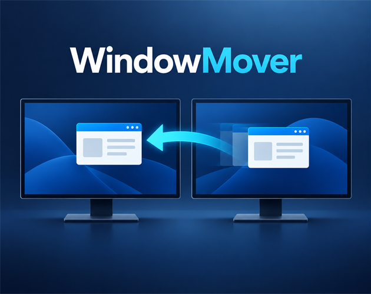

# WindowMover

WindowMover is a lightweight Windows system tray utility that moves the active window to the next monitor with **Ctrl + Alt + M**.

## Download

Open the repository's **Releases** section and download `WindowMover-*-win-x64.zip` from the latest release.

No separate .NET installation is required.

## Features

- Preserves the window's relative position and size.
- Keeps maximized windows maximized.
- Supports mixed resolutions, DPI scaling, and negative virtual desktop coordinates.
- Customizable global keyboard shortcut.
- Follows the Windows display language, with English fallback.
- Manual English and Finnish language choices that apply immediately.
- Optional launch at Windows sign-in.
- No ads, network access, telemetry, or personal data collection.

## How to use

1. Extract the downloaded ZIP archive.
2. Run `WindowMover.exe`.
3. Focus the window you want to move.
4. Press **Ctrl + Alt + M**.

Double-click the WindowMover system tray icon to open settings.

## Building from source

WindowMover requires the .NET 10 SDK on Windows 10 or Windows 11.

```powershell
.\build.ps1
```

The command restores dependencies, builds the Release configuration, and runs
the automated tests. To create a self-contained x64 executable:

```powershell
.\publish.ps1
```

## System requirements

- Windows 10 or Windows 11
- 64-bit x64 processor
- Two or more monitors

## Privacy

WindowMover does not use a network connection or collect or transmit personal data. Settings and any error log remain only in the current user's local AppData folder.

## Known limitation

A normally launched WindowMover instance cannot move windows belonging to applications running as administrator. This is a Windows UIPI security restriction.

This release is not digitally signed, so Windows SmartScreen may display a warning the first time it is launched.
